# Kawach: AI-Powered Parametric Income Insurance for India's Gig Delivery Workers

> **Guidewire DEVTrails 2026 · Phase 2 Submission**
> Team: **NoName.exe**

## Quick Index

- [The Problem in One Paragraph](#the-problem-in-one-paragraph)
- [What We're Building](#what-were-building)
- [Persona: Who We're Protecting](#persona-who-were-protecting)
- [Core Disruptions Covered](#core-disruptions-covered)
- [Weekly Premium Model](#weekly-premium-model)
- [Parametric Trigger & Payout Logic](#parametric-trigger--payout-logic)
- [AI/ML Integration](#aiml-integration)
- [Fraud Detection Architecture](#fraud-detection-architecture)
- [System Architecture](#system-architecture)
- [Application Workflow](#application-workflow)
- [Technology Stack](#technology-stack)
- [How to Run the App](#how-to-run-the-app)
- [Development Plan](#development-plan)
- [Diagrams](#diagrams)
- [Adversarial Defense & Anti-Spoofing Strategy](#adversarial-defense--anti-spoofing-strategy)
- [Insurance Reputation Score](#insurance-reputation-score)
- [Policy Exclusions & Insurance Domain Compliance](#policy-exclusions--insurance-domain-compliance)
- [Regulatory Framework & Compliance](#regulatory-framework--compliance)
- [Key Design Decisions & Justifications](#key-design-decisions--justifications)

---

## The Problem in One Paragraph

Meet **Arjun, 26, a Blinkit delivery rider in BTM Layout, Bengaluru.** He works 10–11 hours a day, completing 15–18 deliveries, earning roughly ₹900–₹1,000 on a good day. He has no fixed salary, no paid leave, and no employer. On a normal June afternoon, rain begins. Within an hour, BTM Layout is waterlogged. Blinkit reduces order dispatch. Arjun stops riding, not because he chooses to, but because the roads are impassable. He earns ₹180 that day. No insurance covers this. No platform compensates him. The loss is entirely his.

This is not a rare edge case. India has **7.7 million gig workers today**, projected to reach **23.5 million by 2029–30** (NITI Aayog, 2022). Delivery partners, food, grocery, Q-commerce, form the fastest-growing segment. They operate entirely outdoors, earn per delivery, and have zero income protection against external disruptions. Existing insurance covers health, vehicles, and accidents. Nobody covers **lost earnings from events outside the worker's control.**

Kawach closes that gap.

---

## What We're Building

Kawach is a **hyperlocal, AI-powered parametric income insurance platform** for Q-commerce delivery riders (Blinkit / Zepto). It monitors environmental conditions across delivery zones in real time, automatically detects disruption events, verifies rider activity via GPS, and triggers instant income compensation, with zero manual claim filing.

**Coverage scope:** Lost income from external disruptions only. No health, no vehicle, no accidents.
**Pricing model:** Weekly premiums, aligned to the gig worker's earnings cycle.
**Payout model:** Automated, parametric, triggered by data, not paperwork.

---

## Persona: Who We're Protecting

| Attribute | Detail |
|-----------|--------|
| **Name** | Arjun (representative persona) |
| **Age** | 26 |
| **Platform** | Blinkit (primary), Zepto (secondary) |
| **City** | Bengaluru, primary zone: BTM Layout |
| **Working hours** | 10–11 hrs/day, 6 days/week |
| **Avg deliveries/day** | 15–18 orders |
| **Avg hourly income** | ₹90–₹102/hr |
| **Monthly net income** | ₹20,000–₹25,000 (after fuel/maintenance) |
| **Current insurance** | None specific to income loss |
| **Key vulnerability** | Monsoon flooding (June–Sept), extreme heat (April–June) |

**Why Q-commerce specifically?** Blinkit and Zepto riders operate within tight 1.5–3 km dark store radii, completing 10-minute deliveries. This makes their income *extremely* sensitive to hyperlocal disruptions, a flooded underpass 500 metres away can halt an entire shift. Food delivery riders have larger radii and more flexibility; Q-commerce riders are the most exposed.

**Arjun's disruption scenario (worked example):**
- Normal day: 3 deliveries/hr × ₹35/delivery = ₹105/hr
- Monsoon disruption (BTM Layout, 90mm rainfall in 3 hrs): 0.8 deliveries/hr × ₹35 = ₹28/hr
- 4-hour disruption window → lost income ≈ ₹308
- Kawach payout (hybrid model, worked below): ₹241–₹280

---

## Core Disruptions Covered

We cover **5 measurable external disruptions** that directly reduce delivery activity in Bengaluru:

| # | Disruption | Trigger Threshold | Monitoring Frequency | Bengaluru Risk |
|---|-----------|-------------------|----------------------|----------------|
| 1 | Heavy Rainfall | ≥ 50 mm within 3 hrs | Every 15 min | High (June–Sept monsoon) |
| 2 | Urban Flooding | ≥ 80 mm + flood-prone zone flag | Every 15 min | High (BTM, Koramangala, Kengeri) |
| 3 | Extreme Heat | ≥ 43°C for ≥ 2 hrs | Every 30 min | Medium (April–May) |
| 4 | Severe Air Pollution | AQI ≥ 300 for ≥ 6 hrs | Every 1 hr | Low–Medium (Dec–Feb) |
| 5 | Severe Thunderstorm | Wind ≥ 60 km/h + storm alert | Event-based | Moderate (pre-monsoon) |

**Why these five?** Each is objectively measurable via third-party APIs, historically frequent in Bengaluru, and directly correlated with delivery activity decline. Crucially, flooding receives the highest weight in our risk model because it causes *complete* delivery stoppage, not just slowdown.

---

## Weekly Premium Model

### How it works

Premiums are set **once per week** based on a rider's primary delivery zone risk score, calculated from historical environmental data, not real-time conditions. This keeps pricing stable and predictable for the worker.

**Zone Risk Score formula:**

```
Risk Score = (Flood Risk × 0.30) + (Rainfall Risk × 0.25)
           + (Heatwave Risk × 0.20) + (Pollution Risk × 0.15)
           + (Storm Risk × 0.10)
```

**Worked example, BTM Layout, Bengaluru:**

| Risk Factor | Score (0–100) | Weight | Contribution |
|-------------|--------------|--------|--------------|
| Flood risk | 70 | 0.30 | 21.0 |
| Rainfall risk | 60 | 0.25 | 15.0 |
| Heatwave risk | 35 | 0.20 | 7.0 |
| Pollution risk | 25 | 0.15 | 3.75 |
| Storm risk | 20 | 0.10 | 2.0 |
| **Zone Risk Score** | | | **48.75 → Moderate** |

**Weekly premium tiers:**

| Risk Category | Score Range | Weekly Premium | Weekly Coverage Limit |
|--------------|-------------|----------------|-----------------------|
| Low Risk | 0–30 | ₹20 | ₹1,200 |
| Moderate Risk | 31–50 | ₹35 | ₹1,600 |
| High Risk | 51–70 | ₹50 | ₹2,000 |
| Very High Risk | 71–85 | ₹70 | ₹2,000 |
| Extreme Risk | 86–100 | ₹90 | ₹2,000 |

**For Arjun in BTM Layout:** ₹35/week for ₹1,600 weekly coverage. That is less than the cost of one meal, for a full week of income protection.

**Seasonal adjustments** are applied at the start of each week:
- Monsoon (June–Sept): Rainfall risk +10%
- Summer (April–May): Heatwave risk +10%
- Winter (Nov–Feb): Pollution risk +10%

**Trigger-to-premium feedback loop:** Real-time disruption events do not change the current week's premium (premiums are locked on purchase). However, every confirmed trigger event updates the zone's historical disruption frequency, which feeds back into the Gradient Boosting risk model during its weekly retraining cycle. A zone that triggers 3 times in a month will see its risk score rise at the next weekly recalculation, and its premium tier will adjust accordingly. This keeps pricing actuarially honest without exposing riders to mid-week price shocks.

**Payout caps:**

| Level | Cap |
|-------|-----|
| Per hour | ₹100 |
| Per disruption event | ₹1,500 |
| Per week | ₹2,000 |
| Per month | ₹6,000 |

---

## Parametric Trigger & Payout Logic

### Five-step automated flow

```
1. Poll environmental APIs (Rainfall: 15 min · Temp: 30 min · AQI: 1 hr)
         ↓
2. Evaluate thresholds per delivery zone
   Rainfall ≥ 50mm/3h · Temp ≥ 43°C · AQI ≥ 300 · Wind ≥ 60km/h
         ↓
3. Compute zone disruption score
   Env_Score = 0.4×Rain_norm + 0.3×AQI_norm + 0.3×Traffic_norm
   Disruption confirmed if Env_Score ≥ 0.6 AND Activity_Drop ≥ 0.4
         ↓
4. Verify rider eligibility
   GPS in disruption zone ≥ 50% of event duration
   Active work session · Policy active · No fraud flags
         ↓
5. Calculate payout via Hybrid Model → release via Razorpay sandbox
```

### Hybrid Payout Model (why four signals beat one)

Most parametric insurance uses a single trigger → fixed payout. We use a **weighted composite score** across three independent signals to minimise *basis risk*, the mismatch between the trigger event and the worker's actual income loss.

```
Hybrid Score = 0.5 × Income_Deviation + 0.3 × Activity_Drop + 0.2 × Env_Score
Final Payout = Expected_Income × Hybrid_Score × Lost_Hours
             (capped at hourly, event, and weekly limits)
```

**Arjun's disruption, worked example:**

| Signal | Calculation | Score |
|--------|-------------|-------|
| Income deviation | (₹90 − ₹28) / ₹90 | 0.69 |
| Activity drop | (18 orders/hr − 5) / 18 | 0.72 |
| Environmental | 0.4×0.89 + 0.3×0.73 + 0.3×0.60 | 0.75 |
| **Hybrid Score** | 0.5×0.69 + 0.3×0.72 + 0.2×0.75 | **0.711** |
| **Final Payout** | ₹90 × 0.711 × 4 hrs = **₹256** | capped at ₹1,500/event ✓ |

---

## AI/ML Integration

### 1. Risk Scoring Engine (Zone-level disruption prediction)
- **Model:** Gradient Boosting (scikit-learn)
- **Features in:** Rainfall frequency (historical 3–5 yr), flood event count, heatwave days/yr, average winter AQI, storm frequency, zone elevation, drainage quality flag
- **Output:** Zone risk score (0–100) → directly drives weekly premium calculation. The ML model's predicted score is the sole input into the premium tier lookup; there is no separate manual pricing step. Premium calculation is therefore entirely AI-driven.
- **Why Gradient Boosting?** Handles non-linear interactions between risk factors (e.g. flood risk is not linear in rainfall, it spikes when drainage capacity is exceeded). Outperforms linear regression on small, structured environmental datasets. Retrained weekly on new disruption event data, so premiums stay calibrated as climate patterns shift.

### 2. Fraud Detection Engine (Anomaly detection on GPS + claim patterns)
- **Model:** Isolation Forest + rule-based validation layer
- **Features in:** GPS speed between consecutive points, location jump distance/minute, idle time ratio, zone boundary crossing frequency, historical claim rate per rider
- **Output:** Fraud risk score (Low / Medium / High / Critical) → payout held if Critical
- **Why Isolation Forest?** Unsupervised, no labelled fraud data needed at launch. Naturally identifies outliers (e.g. a rider whose GPS shows 120 km/h in BTM Layout) without requiring prior fraud examples.

### 3. Income Baseline Estimator (Per-zone, per-hour expected earnings)
- **Model:** Gradient Boosting regression
- **Features in:** POI density (restaurants, dark stores), population density, road connectivity index, historical order volume, time of day, day of week
- **Output:** Expected_Income(zone, time) → baseline for payout calculation
- **Why not use platform data?** Platform earnings APIs are unavailable. Proxy variables (POI density × connectivity / traffic factor) have strong correlation with actual delivery volume in Q-commerce zones.

### 4. Disruption Forecasting (Optional, Phase 3)
- **Model:** Facebook Prophet (time-series)
- **Features in:** Historical weather data, seasonal patterns, IMD forecasts
- **Output:** Probability of disruption event in next 48 hrs → used for proactive rider notifications and dynamic risk adjustment

---

## Fraud Detection Architecture

Multi-layer validation runs before **every** payout:

**Layer 1, GPS Anomaly Detection**
- Speed check: > 80 km/h between consecutive GPS points → flag
- Location jump: > 5 km displacement in 1 minute → flag
- Mock location detection: device-level check for spoofing apps / developer mode
- Path continuity: non-road trajectories flagged

**Layer 2, Activity Verification**
- Minimum distance: > 1 km within any 30-minute window
- Idle threshold: < 15 minutes continuous idle during active session
- Speed range: 10–40 km/h (consistent with urban two-wheeler delivery)
- Zone presence: rider must be in disruption zone for ≥ 50% of event duration

**Layer 3, Duplicate Claim Prevention**
- Each disruption event assigned a unique `Event_ID`
- Uniqueness check: `(Rider_ID + Event_ID + Zone_ID)` → reject if record exists
- One payout per rider per disruption event, enforced at DB level

**Layer 4, Policy Validation**
- Active weekly policy required at time of disruption
- 12–24 hr waiting period after policy purchase (prevents buying after event starts)

**Risk scoring actions:**

| Risk Level | System Response |
|-----------|----------------|
| Low | Session monitored, payout proceeds |
| Medium | Session flagged, payout proceeds with audit log |
| High | Payout held for 24 hrs, manual review queued |
| Critical | Payout blocked, account flagged |

---

## System Architecture

### Component overview

```
External Data Sources
  Weather API (OpenWeatherMap) · AQI/CPCB · GPS/Maps · Flood Alerts · Traffic API
                          ↓
              FastAPI Backend (Python)
    ┌─────────────────────────────────────────────┐
    │  Disruption Engine  │  Risk Scoring Module  │
    │  Fraud Detection    │  Payout Calculator    │
    │  Activity Verifier  │  ML Pipeline          │
    └─────────────────────────────────────────────┘
                          ↓
         Supabase (PostgreSQL + PostGIS)
    Riders · Zones · Policies · Claims · GPS Logs · Audit Trail
                          ↓
         ┌────────────────────────────────┐
         │  Flutter Mobile App (Riders)   │
         │  Admin Dashboard (Web)         │
         │  Firebase Cloud Messaging      │
         │  Razorpay Sandbox (Payouts)    │
         └────────────────────────────────┘
```

### Why mobile-first?

Arjun does not use a laptop. He uses a ₹12,000 Android phone, often with intermittent connectivity. A Flutter mobile app gives us: offline-tolerant GPS session tracking, background location services, push notifications for disruption alerts, and a UI optimised for one-handed use during a shift. The admin dashboard (insurer view) is web-based, insurers work at desks.

### Hyperlocal zone model

The city is divided into **2 km × 2 km monitoring grid cells**, each evaluated independently for environmental triggers. This scale was chosen because:
- Weather APIs provide ~1 km resolution data
- CPCB pollution stations cover 3–5 km spacing
- Blinkit/Zepto dark stores serve 1.5–3 km radii
- Urban flooding in Bengaluru is highly localised (BTM Layout floods while Whitefield is dry)

Bengaluru at this grid size → approximately **185 monitoring zones**. Riders are mapped to their primary zone using GPS centroid of active work sessions.

---

## Application Workflow

### Rider journey (end-to-end)

```
Sign Up / KYC (name, phone, zone, vehicle)
         ↓
Zone assigned · Income baseline estimated
         ↓
Purchase weekly policy (select tier, pay via Razorpay sandbox)
  → 12–24 hr waiting period → coverage active
         ↓
Start work session (GPS tracking begins)
         ↓
Background: zone monitored every 15–30 min
         ↓
Disruption detected in rider's zone?
  YES → rider eligibility verified (GPS + activity + policy)
      → Hybrid Model calculates payout
      → Fraud checks pass?
          YES → Razorpay disburse → push notification to Arjun
          NO  → held for review
  NO  → session continues
         ↓
End session → earnings summary · payout history displayed
```

### Admin / Insurer dashboard (Phase 3)
- Live zone disruption map (Bengaluru grid)
- Active rider count per zone
- Claims triggered today / this week
- Loss ratio by zone and disruption type
- Fraud flagging queue
- Predictive: next 48-hr disruption probability per zone

---

## Technology Stack

| Layer | Technology | Rationale |
|-------|-----------|-----------|
| Mobile App | Flutter (Dart) | Cross-platform, background GPS, offline tolerance |
| Backend API | FastAPI (Python) | Async-first, ideal for real-time polling loops |
| Database | Supabase (PostgreSQL) | Managed Postgres, built-in auth, real-time subscriptions |
| Geospatial | PostGIS (via Supabase) | Zone mapping, GPS-to-zone assignment, spatial queries |
| ML / AI | Python · scikit-learn · Prophet | Gradient Boosting for risk scoring + fraud; Prophet for forecasting |
| Weather API (Live) | OpenWeatherMap (student plan) | Real-time rainfall, temperature, wind speed, storm alerts for disruption polling |
| Weather API (Historical) | Open-Meteo (free, no key) | Historical weather data for ML model training, one-time bulk pull |
| Pollution API | AQICN (free tier) | Real-time AQI per city zone |
| Payment | Razorpay Sandbox | Simulated premium collection + payout disbursement |
| Notifications | Firebase Cloud Messaging | Push alerts for disruption events and payout confirmations |

---

## How to Run the App

### Prerequisites

- Flutter SDK installed and available in PATH
- Xcode (for iOS Simulator on macOS) or Android Studio + emulator/device
- A connected physical device or running simulator/emulator

Official setup links:
- Flutter SDK install guide: https://docs.flutter.dev/get-started/install
- Android Studio: https://developer.android.com/studio
- Xcode (macOS): https://developer.apple.com/xcode/

### One-Time Environment Check

Run these once to verify local setup:

```bash
flutter doctor
flutter doctor -v
flutter devices
```

Make sure at least one device/emulator is listed before running the app.

### Run Steps (Flutter Mobile App)

1. Open a terminal in the repository root.
2. Move into the mobile app directory:

```bash
cd mobile
```

3. Install dependencies:

```bash
flutter pub get
```

4. (Optional) Clean old build cache if you face startup/build issues:

```bash
flutter clean
flutter pub get
```

5. Start the app:

```bash
flutter run
```

### Run on a Specific Platform

Use a device id from `flutter devices`:

```bash
flutter run -d <device_id>
```

Examples:

```bash
flutter run -d ios
flutter run -d android
flutter run -d chrome
```

### Build Commands (Submission/QA)

```bash
flutter analyze
flutter test
flutter build apk --release
flutter build ios --release
```

Use `flutter build ios --release` on macOS with Xcode configured.

### Helpful Commands

```bash
flutter doctor
flutter devices
flutter clean
flutter pub get
```

### Notes

- The current demo flow is local-first in the Flutter app and can run without full backend setup.
- If a device is not selected automatically, run `flutter devices` and then `flutter run -d <device_id>`.
- First app launch may ask for location permissions; allow them to test session and map simulation flows.
- Core demo path to verify after launch: Splash → Phone/OTP → Profile Setup → Policy → Home → Map Simulation → Claims.

---

## Development Plan

### Phase 1 (Completed: Ideation & Foundation)
- [x] Problem research and persona definition
- [x] Parametric insurance domain research
- [x] Disruption identification and threshold design
- [x] Hyperlocal zone model design
- [x] Income loss calculation models (4 models, hybrid selected)
- [x] Weekly premium model with worked examples
- [x] Fraud detection architecture
- [x] System architecture and tech stack selection
- [x] Diagrams: system architecture, trigger flow, fraud module, disruption engine, app workflow

### Phase 2 (Current Submission: Local-First Prototype)
- [x] Flutter app flow implemented: onboarding, profile setup, policy selection, payment success, home, map, claims, profile
- [x] Policy acceptance integrated via in-app markdown document modal
- [x] Claims screen supports Active + History tabs and staged pipeline progression
- [x] Map simulation expanded to 10 Bengaluru zones with disruption-driven auto-claim flow
- [x] Local persistence implemented for rider, policy, session, conditions, and claims
- [x] Dynamic premium preview and risk-band presentation integrated in UI
- [x] Profile includes reputation display, discount context, and policy controls

### Phase 3 (Weeks 5–6, Scale & Optimise)
- [ ] Real backend APIs connected end-to-end (auth, sessions, disruptions, claims, payouts)
- [ ] Background GPS tracking and server-side live polling wired to backend
- [ ] Full offline/error/skeleton loading coverage across all screens
- [ ] Advanced fraud detection: Isolation Forest, mock location detection
- [ ] Hybrid payout model: full composite score calculation
- [ ] Instant payout: Razorpay sandbox disburse to wallet/UPI
- [ ] Admin dashboard: zone map, loss ratio, fraud queue
- [ ] Rider dashboard: earnings protected, active coverage, payout history
- [ ] Prophet-based disruption forecasting (48-hr ahead)
- [ ] Final demo: live disruption simulation → auto claim → payout

---

## Diagrams

### System Architecture


### End-to-End Application Flow


### Parametric Trigger Flow


### Disruption Monitoring & Risk Module


### Fraud Detection Module


### Mobile App Structure


---


---

## Adversarial Defense & Anti-Spoofing Strategy

### The Threat Model

A coordinated syndicate of riders uses GPS spoofing applications to fake their location inside a disruption zone while physically sitting at home. They organise via Telegram, meaning the fraud is simultaneous, large-scale, and timed precisely to coincide with a real weather event to make the false claims blend in with legitimate ones. Basic GPS coordinate validation cannot distinguish between a genuinely stranded rider and a spoofed one because both produce GPS coordinates inside the disruption zone. The defense must therefore operate on signals that GPS spoofing cannot fake.

---

### 1. Differentiating a Stranded Rider from a Bad Actor

The core insight is that a GPS spoofer is physically stationary at home while their device reports movement inside a flood zone. Physical stillness leaks across multiple sensor channels that spoofing apps do not touch.

**Accelerometer and gyroscope cross-validation**

A delivery rider navigating a waterlogged street produces continuous micro-vibrations: road surface feedback, engine vibration, handlebar movement, braking. A rider sitting at home produces none of these. The Kawach mobile app reads the device accelerometer and gyroscope at 10 Hz during active sessions. A session reporting GPS movement inside a disruption zone but showing accelerometer variance below the threshold for a stationary person is immediately flagged as physically inconsistent.

| Condition | GPS signal | Accelerometer variance | Classification |
|-----------|-----------|----------------------|----------------|
| Genuine stranded rider | Inside zone | Low (stopped, waiting) | Eligible, inactivity consistent with disruption |
| Genuine active rider | Inside zone | High (moving, vibrating) | Eligible |
| Spoofer at home | Inside zone (faked) | Near zero (lying still) | Flagged, physical stillness contradicts reported location |

**Network cell tower triangulation**

GPS coordinates can be faked at the application layer. Cell tower association cannot. The device's network registration data, which towers it is connected to and their signal strengths, is collected passively and cross-referenced against the reported GPS position. A device claiming to be in BTM Layout but connected to towers serving Yelahanka is a hard contradiction. This check requires no additional hardware and cannot be bypassed by standard GPS spoofing apps.

**Battery and thermal signature**

A rider navigating in 35°C heat with GPS, screen, and motor running for 4 hours has a predictable battery drain curve and elevated device temperature. A device running a spoofing app at home on Wi-Fi has a completely different profile: slower drain, stable temperature, often connected to a charger. Kawach monitors battery level deltas and, on supported Android devices, ambient temperature reported by the hardware thermal sensor.

**Dark store order data cross-reference**

This is the strongest signal available. If a rider claims to have been actively working during a disruption event, the platform cross-references Blinkit/Zepto platform activity logs (where API access exists) or infers activity from GPS trajectory patterns that match known dark store pickup routes. A rider with zero order completions, zero route patterns matching any dark store, and no pickup-zone dwell time during the claimed work session has no legitimate basis for a payout regardless of their reported location.

---

### 2. Detecting a Coordinated Fraud Ring

Individual spoofing is detectable through the signals above. A syndicate of 500 riders is detectable through network-level behavioral analysis that no individual spoofer can hide from.

**Simultaneous claim surge detection**

Under genuine disruption conditions, claims arrive in a geographic wave, riders in the most severely affected micro-zones trigger first, then adjacent zones as conditions spread. Syndicate fraud produces a different pattern: a sudden vertical spike in claims across multiple zones at the exact moment a weather alert is issued, with no geographic propagation pattern. Kawach's disruption engine maintains a rolling baseline of expected claims-per-zone-per-hour. A zone receiving 10x its expected claim rate within 5 minutes of a red-alert trigger fires a syndicate flag, not just an individual fraud flag.

**Device fingerprint clustering**

Spoofing applications leave consistent fingerprints: identical mock location provider signatures, identical GPS update cadences (spoofing apps typically update at exactly 1 Hz, real GPS varies), and identical sensor metadata patterns. When 50 devices in a single disruption event share the same GPS update interval, the same spoofing app signature, and the same accelerometer silence profile, that is not coincidence. Kawach hashes device sensor metadata and compares fingerprints across all claims within a disruption event window. Clusters of 5 or more devices with matching fingerprints are quarantined together.

**Social graph inference from zone entry timing**

Syndicate members coordinating via Telegram enter the spoofed zone within seconds of each other, because they receive the same message at the same time and trigger their spoofing apps simultaneously. Legitimate riders drift into disruption zones continuously as their shifts progress. Kawach records zone entry timestamps for all active sessions. A burst of 20+ zone entries within a 90-second window is a coordination signal. Real riders entering a flood zone are spread across hours, not seconds.

**Velocity impossibility across historical sessions**

Syndicate members often rotate across multiple fake zones in a single week to maximise payouts. A rider whose historical GPS sessions show them operating in Koramangala on Monday and Whitefield on Tuesday but claiming to be in BTM Layout during Wednesday's flood event, when their device has never previously logged activity in BTM Layout, is anomalous. Zone affinity scoring tracks each rider's historical operating zones. Claims from zones where a rider has less than 5% historical session presence are weighted as low-credibility.

**Specific data points the system analyses beyond GPS coordinates:**

| Data Point | What it detects |
|------------|----------------|
| Accelerometer variance (10 Hz) | Physical stillness while reporting movement |
| Gyroscope rotation delta | Stationary device vs. moving vehicle |
| Cell tower association | Location contradiction at network layer |
| Battery drain rate | Home charging vs. active outdoor use |
| GPS update interval regularity | Spoofing app cadence vs. real GPS jitter |
| Mock location provider flag | Device-level spoofing app detection |
| Dark store dwell time | No pickup activity despite claiming active session |
| Claim surge rate per zone | Syndicate coordination signal |
| Zone entry timestamp clustering | Telegram-coordinated simultaneous trigger |
| Device sensor metadata hash | Shared spoofing app fingerprint across devices |
| Historical zone affinity score | Rider claiming a zone they never work in |

---

### 3. UX Balance: Protecting Honest Riders from False Positives

The greatest risk of an aggressive anti-fraud system is penalising genuine workers. A rider in a real flood zone may have dropped their phone, exhausted their battery, or lost cell signal entirely, all of which can look like fraud signals if interpreted naively. Kawach's approach is to separate detection from denial.

**Tiered response, not binary block**

No single fraud signal blocks a payout. Each signal contributes to a fraud score. Only a score above the Critical threshold results in a held payout. A rider with a dead battery and no accelerometer data gets a Medium score, payout proceeds with an audit log, not a block.

| Fraud Score | Signals present | Action |
|-------------|----------------|--------|
| Low (0–30) | 0–1 weak signals | Payout proceeds, session logged |
| Medium (31–60) | 2–3 signals, individually explainable | Payout proceeds, audit trail created |
| High (61–85) | Multiple correlated signals | Payout held 24 hrs, rider notified, self-declaration requested |
| Critical (86–100) | Coordinated signals including device fingerprint match | Payout blocked, case queued for review |

**Self-declaration for High-scored claims**

When a claim scores High, the rider receives a push notification explaining that their claim is under review and asking them to confirm one of three things: they were genuinely working, they experienced a network drop, or they were resting during the event. This is not an accusation, it is framed as a verification step. A honest rider confirms in one tap. A bad actor who did not expect this step typically abandons the claim. Confirmation data feeds back into the model to improve future scoring.

**Network drop grace window**

Bad weather causes genuine GPS signal loss and cell tower handoff failures. Kawach applies a 3-missed-ping grace window: up to 3 consecutive GPS updates can be absent without penalising the session. Beyond 3 missed pings, the session is marked as signal-interrupted rather than fraudulent, and the rider's last confirmed zone position is held for up to 15 minutes before the session is paused. This directly addresses the scenario where an honest rider in a genuine flood zone loses signal precisely because conditions are severe.

**Transparent claim status in the app**

Riders can see their claim status in real time, Active, Under Review, Approved, or Held. If held, they see a plain-language explanation (not a fraud accusation) and an estimated resolution time of 24 hours. This reduces support overhead and prevents the perception that the platform arbitrarily withholds money. For the 99% of legitimate riders, the experience is invisible, their claim clears automatically. The friction only surfaces for genuine anomalies.

**Syndicate quarantine does not punish bystanders**

When a coordinated fraud ring is detected in a zone, Kawach does not freeze all claims from that zone. It freezes only the claims belonging to the flagged device cluster. Legitimate riders in the same zone who show normal accelerometer variance, normal cell tower data, and normal zone affinity continue to receive payouts without interruption. The syndicate is isolated; the genuine disruption event is not.

---

---

## Insurance Reputation Score

### The Concept

Every Kawach rider carries a dynamic **Insurance Reputation Score (0-100)**, a portable, behaviour-driven trust identity built from their real activity on the platform. It is the first financial trust score designed specifically for India's gig economy.

Unlike traditional credit scores that require bank history or employment records, the Kawach reputation score is built entirely from verified gig work behaviour. A rider who has never had a bank loan, never filed a tax return, and never held a formal job can build a high reputation score simply by working consistently and honestly.

The score persists across weeks, compounds over time, and travels with the rider. It is not reset by a single bad event. It is not zone-dependent. It is theirs.

### Why This Is Different

Every other component of Kawach resets weekly, premiums, coverage limits, payout caps. The Insurance Reputation Score is the only feature that gets better the longer a rider uses the platform. This creates three things simultaneously that the rest of the architecture handles separately:

- A fraud deterrent (riders with high scores have too much to lose)
- A dynamic pricing engine (score directly adjusts premium)
- A retention mechanic (the score is worth protecting)

It also creates something no other parametric insurance product in India has attempted: a portable gig worker financial identity. A rider who builds a score of 85 on Kawach has verifiable proof of consistent, honest work behaviour, usable beyond insurance for loan access, platform incentives, or welfare scheme eligibility.

### Score Components

| Factor | Weight | What It Measures |
|--------|--------|-----------------|
| Verified work activity | 30% | GPS-confirmed active sessions per week |
| Session consistency | 25% | Regularity of working hours and zone presence over time |
| Claim accuracy | 20% | Ratio of valid confirmed claims to total claims triggered |
| Fraud signal history | 15% | Accumulated fraud risk score across all sessions |
| Policy continuity | 10% | Consecutive weeks of active coverage without lapse |

The score is recalculated every Sunday night alongside the weekly premium cycle. It uses a rolling 12-week window, recent behaviour is weighted more heavily than older behaviour, so a rider who had a difficult month can recover their score within 6-8 weeks of consistent activity.

### Score Bands and Benefits

| Score | Tier | Premium Effect | Claim Processing | Verification |
|-------|------|---------------|-----------------|--------------|
| 80-100 | Trusted | 15% discount | Instant, zero additional checks | GPS only |
| 60-79 | Established | 5% discount | Standard automated | GPS + activity |
| 40-59 | Building | Standard rate | Standard automated | Full 4-layer |
| 20-39 | Developing | 10% loading | Enhanced checks | Full 4-layer + manual flag |
| 0-19 | Restricted | 20% loading | Manual review required | Held pending review |

### Worked Example, Arjun after 8 weeks

| Factor | Arjun's Score | Weight | Contribution |
|--------|--------------|--------|--------------|
| Verified work activity | 88 | 0.30 | 26.4 |
| Session consistency | 82 | 0.25 | 20.5 |
| Claim accuracy | 100 | 0.20 | 20.0 |
| Fraud signal history | 95 | 0.15 | 14.25 |
| Policy continuity | 100 | 0.10 | 10.0 |
| **Reputation Score** | | | **91.15, Trusted** |

At 91.15, Arjun pays Rs. 35 x 0.85 = **Rs. 29.75/week** (rounded to Rs. 30), receives instant payouts with zero additional verification, and has a portable trust record that reflects 8 weeks of consistent, honest work.

### The Bigger Picture

India has 7.7 million gig workers with no formal financial identity. Kawach's Insurance Reputation Score is the beginning of an answer to that. It does not require a bank. It does not require an employer. It requires only that a rider shows up, works honestly, and lets the platform verify it.

That is infrastructure, not just a feature.

---

---

## Policy Exclusions & Insurance Domain Compliance

### Standard Exclusions

Kawach follows standard parametric insurance exclusion principles. The following events are explicitly excluded from coverage regardless of whether they cause income disruption:

| Exclusion Category | Specific Exclusions |
|-------------------|---------------------|
| War and conflict | Acts of war, invasion, armed conflict, military operations, terrorism |
| Civil unrest | Riots, insurrection, rebellion, unless a government-declared curfew is issued (government curfews are covered as a social disruption trigger) |
| Pandemic and epidemic | Government-declared pandemics, epidemics, or biological events, including platform shutdowns caused by public health emergencies |
| Nuclear and radiation | Nuclear reaction, radioactive contamination, ionising radiation |
| Government seizure | Confiscation, nationalisation, or requisition of assets by government authority |
| Intentional acts | Any disruption deliberately caused or provoked by the insured rider |
| Pre-existing conditions | Disruptions that began before the policy activation window (enforced by the 12-24 hour waiting period) |
| Fraud or misrepresentation | Claims where the rider is found to have manipulated location data, activity signals, or claim information |
| Platform-side decisions | Income loss caused by platform deactivation, account suspension, or app-side policy changes, Kawach insures against environmental and social disruptions, not platform commercial decisions |

### Coverage Scope Clarification

Kawach covers **income loss caused by measurable external environmental and social disruptions** that make delivery operations temporarily impossible or unsafe. It does not cover:

- Health, life, or accidental injury (covered by separate products)
- Vehicle damage or repair costs
- Platform incentive changes or surge pricing fluctuations
- Personal financial decisions or voluntary inactivity
- Income loss from causes not verifiable through objective third-party data sources

This scope is intentionally narrow. Narrow scope reduces basis risk, simplifies actuarial modelling, and makes the product financially sustainable at Rs. 20-90 weekly premiums.

### Subrogation and Double Recovery

A rider who receives a Kawach payout for a disruption event may not also claim compensation for the same event from another insurance product, government welfare scheme, or platform-provided compensation. If double recovery is detected, the overpaid amount is deducted from the rider's next eligible payout. This is standard subrogation practice in Indian insurance under IRDAI guidelines.

---

## Regulatory Framework & Compliance

### IRDAI Regulatory Positioning

Kawach operates at the intersection of two established Indian insurance frameworks:

**1. Parametric Insurance under IRDAI Sandbox**

The Insurance Regulatory and Development Authority of India (IRDAI) introduced the Regulatory Sandbox framework in 2019 (IRDAI (Regulatory Sandbox) Regulations, 2019) to allow insurtech products to be tested in a controlled environment before full licensing. Kawach's parametric income protection model fits squarely within the sandbox criteria:

- It is innovative and does not fit existing standard product categories
- Coverage is measurable and objective (no subjective loss assessment)
- It targets an underserved segment (gig workers)
- Premium and payout structures are transparent and pre-defined

The sandbox allows up to 12 months of live testing with real customers before requiring full IRDAI product approval.

**2. Code on Social Security, 2020**

The Code on Social Security, 2020 (CoSS 2020) formally recognises gig and platform workers within India's social security framework for the first time. Key provisions directly relevant to Kawach:

- Section 114 mandates the central government to frame welfare schemes for gig workers covering life and disability cover, health and maternity benefits, old age protection, and any other benefit as determined by the government
- Section 109 enables the creation of Social Security funds financed through platform contributions
- The legislation explicitly identifies delivery partners on platforms like Blinkit and Zepto as platform-based gig workers entitled to these protections

Kawach's parametric income protection product complements CoSS 2020, it does not replace government welfare but fills the income disruption gap that the legislation does not yet address.

**3. Rajasthan Platform Based Gig Workers (Registration and Welfare) Act, 2023**

Rajasthan became the first Indian state to legislate specifically for gig worker welfare. The act:

- Creates a Gig Workers Welfare Board
- Establishes a Welfare Fund financed by platform contributions
- Mandates registration of gig workers to enable benefit access

Kawach's Insurance Reputation Score is directly compatible with this registration model, a rider's Kawach score could serve as verifiable evidence of work history for welfare scheme eligibility.

### Compliance Requirements for Production Deployment

| Requirement | Regulatory Basis | Status for Hackathon |
|-------------|-----------------|----------------------|
| IRDAI product approval or sandbox registration | IRDAI Act 1999, Sandbox Regulations 2019 | Not required for hackathon prototype |
| Partner insurer tie-up | All parametric products require a licensed Indian insurer as underwriter | Simulated for hackathon |
| KYC and AML compliance | Prevention of Money Laundering Act, 2002 | Phone-based KYC simulated |
| Data localisation | IT Act 2000, RBI data localisation guidelines | Supabase India region selected |
| UPI payment compliance | NPCI UPI guidelines | Razorpay sandbox used |
| GST on insurance premiums | 18% GST applicable on insurance premiums | Not applied in prototype |

### Distribution Model and Regulatory Path

The most compliant distribution path for Kawach at scale is a **Corporate Agent arrangement** with a licensed Indian insurer. Under this model:

- Kawach operates as a technology platform and corporate agent
- A licensed insurer (e.g. Bajaj Allianz, ICICI Lombard, or a dedicated insurtech insurer) underwrites the risk
- Kawach handles onboarding, monitoring, claim triggering, and payout processing
- The insurer handles regulatory compliance, reinsurance, and capital requirements

This is the same model used by Digit Insurance, Acko, and other Indian insurtechs that operate as technology-first, asset-light insurance distributors.

---
## Key Design Decisions & Justifications

**Why parametric over traditional insurance?**
Arjun's income disruptions are simultaneous (affect hundreds of riders at once), short-duration (3–8 hrs), and objectively measurable. Traditional insurance requires individual damage assessment, too slow, too expensive, and impractical for events that last a few hours. Parametric triggers fire automatically when thresholds are crossed, delivering compensation within the same day.

**Why weekly pricing?**
Gig workers are paid weekly by platforms. A monthly premium requires upfront capital that many workers don't hold. ₹35/week is a psychologically accessible number, one less fast food order, and aligns premium payment timing with earnings receipt.

**Why the Hybrid Model over a single trigger?**
A single environmental trigger creates basis risk: the trigger fires but the rider wasn't actually affected, or vice versa. By combining income deviation (50%), activity drop (30%), and environmental score (20%), we triangulate actual impact from three independent data sources. This is the same principle used by Swiss Re and Arbol in their parametric products, multiple correlated signals reduce false payouts without reducing valid ones.

**Why 2 km × 2 km zones?**
Smaller than ward boundaries (which average 15–20 km²), larger than individual GPS points. This scale matches the operational radius of a Blinkit dark store, the spatial resolution of CPCB pollution data (3–5 km station spacing), and the granularity of modern weather APIs (~1 km). It is the smallest unit at which all three data sources are reliable simultaneously.

---

*Kawach · NoName.exe · Guidewire DEVTrails 2026 · Phase 2*